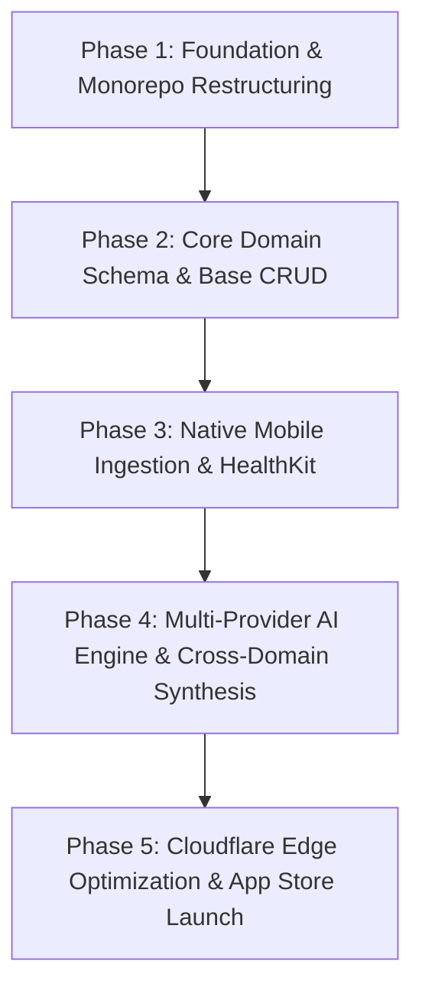

# Comprehensive Product Strategy, Architecture & Feasibility Audit
## Transformation of FlowState into an AI-Powered Unified Life OS (Finances, Health, Notes, Habits)

*Target Repository:* `FLOWSTATEV1`  
*Target Architecture:* Monorepo (`pnpm` + Turborepo + Expo + Next.js + Cloudflare + Supabase)  
*Document Version:* 1.0.0 — Production Blueprint & Critical Teardown  
*Date:* September 2026

---

## Table of Contents
1. [Executive Summary & The "All-in-One Life OS" Reality Check](#1-executive-summary--the-all-in-one-life-os-reality-check)
2. [Brutal Critique: Why Most "Life OS" Apps Fail & How to Survive](#2-brutal-critique-why-most-life-os-apps-fail--how-to-survive)
3. [The 4 Core Life Domains: Detailed UX & AI Functional Specification](#3-the-4-core-life-domains-detailed-ux--ai-functional-specification)
   - [3.1 Finances](#31-finances)
   - [3.2 Health & Biometrics](#32-health--biometrics)
   - [3.3 Notes & Second Brain](#33-notes--second-brain)
   - [3.4 Habits & Behavioral Momentum](#34-habits--behavioral-momentum)
   - [3.5 The Cross-Domain "Life Synthesis" Layer](#35-the-cross-domain-life-synthesis-layer)
4. [Name & Brand Identity Options](#4-name--brand-identity-options)
5. [Monetization, Packaging & Unit Economics](#5-monetization-packaging--unit-economics)
6. [Target Architecture (Inheriting Estavo Monorepo Patterns)](#6-target-architecture-inheriting-estavo-monorepo-patterns)
   - [6.1 Monorepo Topology & Package Structure](#61-monorepo-topology--package-structure)
   - [6.2 Cloudflare + OpenNext + Edge Deployments](#62-cloudflare--opennext--edge-deployments)
   - [6.3 Database Schema Blueprint (PostgreSQL / Supabase)](#63-database-schema-blueprint-postgresql--supabase)
   - [6.4 Auth, Session Security & PII Encryption](#64-auth-session-security--pii-encryption)
7. [Step-by-Step Implementation Roadmap](#7-step-by-step-implementation-roadmap)

---

## 1. Executive Summary & The "All-in-One Life OS" Reality Check

You are taking a minimalist, static HTML/CSS/JS focus timer (`FLOWSTATEV1`) and pivoting it into a **full-scale, cross-platform personal operating system** covering **Finances, Health, Notes, and Habits**, governed by an autonomous AI agent.

### The Big Promise vs. The Real Problem
- **The User Fantasy:** "I will have one app for everything in my life. An AI will understand my budget, sleep, journal entries, and workouts, and optimize my existence."
- **The Engineering & Behavioral Reality:** The graveyard of "All-in-One Life OS" apps is massive (e.g., failed Notion templates, complex Obsidian vaults that users abandon after 14 days, cluttered apps that are mediocre at 4 things instead of great at 1).
- **The Path to Dominance:** If you build 4 siloed dashboards with basic CRUD and an OpenAI wrapper on top, **the app will churn 85% of users within 30 days**. To succeed, the app must not be a collection of 4 manual tracking spreadsheets; it must be an **automated behavioral feedback loop** where cross-domain data creates insights that no single-purpose app can provide.

---

## 2. Brutal Critique: Why Most "Life OS" Apps Fail & How to Survive

### Trap 1: The "Manual Entry Tax" (The #1 Killer of Life Apps)
- **The Problem:** Nobody wants to log every coffee they buy, every rep they bench press, every paragraph of thought, and check off 12 habit boxes daily. By day 7, the friction overwhelms the novelty.
- **The Antidote (Ambient Ingestion):**
  - **Finances:** Bank sync via Plaid / Stitch / SaltEdge or zero-friction receipt OCR + SMS transaction parsing.
  - **Health:** Native Apple HealthKit & Google Health Connect passive background polling. Zero manual entry for sleep, steps, resting heart rate, or workouts.
  - **Notes:** Voice-to-structured-markdown (Whisper / Groq / Deepgram) in under 3 taps with automatic domain classification.
  - **Habits:** Derived habits (e.g. habit "Sleep 8 hours" automatically ticks when Apple Health logs 8h; "Stay within budget" auto-ticks based on spend).

### Trap 2: The "Master of None" Dilemma
- In finances, you are competing with **YNAB, Copilot, Monarch**.
- In health, you are competing with **Whoop, Oura, Apple Health, MacroFactor**.
- In notes, you are competing with **Notion, Obsidian, Apple Notes, Reflect**.
- In habits, you are competing with **Streaks, Habitica, Atomic**.
- **The Solution:** Do not try to replicate all advanced features of YNAB or Obsidian. Build the **essential 20% of features that capture 80% of personal utility**, then win on the **synthesis layer** that none of the vertical apps possess:
  > *"When your sleep dips below 6.5 hours for 3 consecutive days, your discretionary spending on dining out increases by 42% and your afternoon habit completion drops to zero. Canceling afternoon deep work today."*

### Trap 3: LLM Cost vs. User Subscription Margin
- Sending raw health timeseries, complete transaction histories, and endless daily journals into Claude 3.5 Sonnet or DeepSeek on every request will blow through your margins immediately.
- **The Solution:** **Tiered AI Pipeline**:
  - Small fast embeddings / SLM for categorization and semantic search.
  - Background edge cron jobs running deterministic rules for pattern matching.
  - LLMs reserved exclusively for conversational synthesis, weekly tactical reviews, and complex intent resolution.

---

## 3. The 4 Core Life Domains: Detailed UX & AI Functional Specification

### 3.1 Finances (Wealth & Cashflow Momentum)
*Goal: Zero-guilt proactive budgeting, net-worth visibility, and autonomous leak detection.*

- **Core Capabilities:**
  - **Account Aggregation & Manual Fallback:** Connect bank feeds via Plaid / Stitch Money (South Africa / UK / US), or quick camera receipt scan.
  - **Cash Flow Velocity:** Track "Daily Safe-to-Spend" rather than rigid monthly bucket percentages.
  - **Subscription Bloodhound:** Passive detection of recurring subscriptions, flagging price hikes and zombie services.
- **AI-Powered Capabilities:**
  - **Natural Language Expense Capture:** *"Paid 450 ZAR for dinner with Alex at Tigers Milk"* parses into `category: Dining`, `amount: 450`, `currency: ZAR`, `entity: Tigers Milk`, `tags: [social]`.
  - **Predictive Burn Warning:** Proactively alert if end-of-month cash reserve will be breached based on pending recurring bills.

### 3.2 Health & Biometrics (Physical & Mental Energy Engine)
*Goal: Bridge the gap between raw biometric numbers and daily performance capability.*

- **Core Capabilities:**
  - **Passive Biometric Aggregation:** Apple HealthKit & Google Health Connect sync (Sleep duration/stages, Resting Heart Rate, HRV, Steps, Active Calories, VO2 max).
  - **Daily Recovery & Readiness Score (1-100):** Synthesizing HRV baseline shift + deep sleep percentage + previous day's physical strain.
  - **Frictionless Nutrition Logging:** Photo-to-macronutrients (using multi-modal vision models) or barcode scan.
- **AI-Powered Capabilities:**
  - **Burnout Early-Warning:** Correlates dropping HRV trends with increasing work focus timer hours to prevent severe crashes.
  - **Adaptive Workout Recommendation:** Suggests recovery walk vs. heavy lifting session based on morning biometric readiness.

### 3.3 Notes & Second Brain (Clarity & Knowledge Capture)
*Goal: Instant capture, automatic entity extraction, and zero-effort contextual retrieval.*

- **Core Capabilities:**
  - **Audio-First Quick Capture:** Floating action button on mobile that records voice, transcribes with Whisper, and structures into tidy Markdown.
  - **Bi-directional Linking & Auto-Tagging:** Automatically associates notes with specific habits, projects, financial goals, or health events.
  - **Daily Journal & Reflection Engine:** Morning intention setting and evening wind-down debriefs.
- **AI-Powered Capabilities:**
  - **Vector Semantic Search:** Query your own memories: *"What was the name of the contractor Mark recommended for our solar inverter last month?"*
  - **Autonomous Weekly Synthesis:** Automatically drafts a Friday retrospective synthesizing all notes created during the week.

### 3.4 Habits & Behavioral Momentum (Atomic Identity Transformation)
*Goal: System-driven consistency without notification fatigue.*

- **Core Capabilities:**
  - **Streak Protection & Grace Periods:** Eliminates the psychological discouragement of breaking a 30-day streak due to illness or travel.
  - **Context-Aware Reminders:** Triggers habit prompts based on location or calendar schedule (e.g., "Arrived at gym", "Focus timer finished").
  - **Habit Stacking Chains:** Linking habits (e.g., After morning coffee → 5 mins journaling → take vitamins).
- **AI-Powered Capabilities:**
  - **Friction Detection:** If a user fails habit "Meditate 15m" for 4 days in a row, the AI proactively intervenes: *"You haven't meditated this week. Would you like to scale it down to 3 minutes today to keep the identity alive?"*
  - **Automated Verification:** Ticks off habits automatically using biometric or calendar proof (e.g., "Walk 8,000 steps" auto-completes via HealthKit).

### 3.5 The Cross-Domain "Life Synthesis" Layer (The Moat)
This is what makes the product completely irreplaceable.

| Health Input | Financial Event | Note / Journal Sentiment | AI Cross-Domain Prescription |
|---|---|---|---|
| HRV down 25%, 5h sleep | Dining out + Uber spend spike | "Overwhelmed with deadlines" | **Emergency Protocol:** AI schedules focus blocks in 25m increments, adjusts Safe-to-Spend limit down, and suggests ordering high-protein meal instead of junk food. |
| 8.5h sleep, high HRV | Consistent budget adherence | "Feeling motivated, clear head" | **Sprint Mode:** AI suggests tackling hardest project task, raises daily productivity targets. |

---

## 4. Name & Brand Identity Options

The name must escape the "productivity timer" niche of `FlowState` while retaining a feeling of mastery, calm, and intelligence:

| Name | Vibe / Positioning | Domain Suitability | Rationale |
|---|---|---|---|
| **Aevum** | Latin for eternal time / life era; clean, luxury, minimalist | `aevum.app`, `aevum.life` | Sophisticated, sounds like Apple/Arc design language. |
| **Kuro** / **Kuro OS** | Japanese aesthetic for disciplined mastery and clarity | `kuro.so`, `kuro.app` | Short, memorable, punchy mobile app icon. |
| **Soma** / **SomaOS** | Greek for body/mind unified; holistic personal operating system | `soma.life`, `somaos.app` | Perfectly encapsulates health + habits + mind + wealth. |
| **FlowState (Rebrand)** | Evolution of existing brand | `flowstate.app`, `flowstate.co` | Retains initial equity, but risks being pigeonholed as just a Pomodoro timer. |
| **Nexus Life** | Central connection of all personal domains | `nexuslife.app` | Direct, communicative, enterprise-grade feel. |

*Recommendation:* **Aevum** or **SomaOS**.

---

## 5. Monetization, Packaging & Unit Economics

### 5.1 Pricing Architecture
- **Free Tier (The Local Habit & Focus Engine):**
  - Web + Mobile offline access.
  - Manual habit tracking + basic Pomodoro focus timer.
  - Local-only notes (Markdown).
  - Basic manual finance logging (up to 30 transactions/month).
  - *No Cloud Sync, No Bank Feeds, No Advanced AI Synthesis.*
- **Pro Tier ($9.99 / month or $79 / year):**
  - Full Cross-Device Cloud Sync (End-to-End Encrypted).
  - Apple HealthKit & Google Health Connect sync.
  - Voice-to-Note Whisper transcription (unlimited).
  - AI Domain Assistant (Autonomous categorizations, daily insights).
  - Bank transaction sync (via Plaid / Stitch).
  - Weekly Life Synthesis Reports.
- **Founder / Lifetime Club ($199 - $249 one-off):**
  - Limited to first 1,000 users. Early cashflow injection to fund server & API infrastructure.

### 5.2 Unit Economics Safeguard (Preventing AI Bankruptcy)
- **Token Budgeting:** Cap complex multi-step reasoning models (e.g. Claude 3.5 Sonnet / DeepSeek Reasoner) to 20 detailed inquiries per day.
- **Batch Processing:** Run cross-domain synthesis as a scheduled nocturnal cron job using cheaper, high-throughput models (e.g. DeepSeek V3 / Gemini Flash).

---

## 6. Target Architecture (Inheriting Estavo Monorepo Patterns)

To build this rapidly and maintain institutional-grade quality, we apply the exact monorepo, pnpm catalog, Cloudflare OpenNext, and Supabase architecture proven in the `Estavo` repository.

### 6.1 Monorepo Topology & Package Structure

```
├── apps/
│   ├── web/                    ← Next.js 15 App Router (Desktop Web App & Command Center)
│   │   ├── src/app/
│   │   │   ├── (auth)/         ← OTP passwordless login
│   │   │   ├── (dashboard)/    ← Dashboard, Finance, Health, Notes, Habits routes
│   │   │   └── api/            ← OpenNext / Edge API routes
│   │   ├── open-next.config.ts ← Cloudflare Workers deployment config
│   │   └── wrangler.toml
│   │
│   ├── mobile/                 ← Expo SDK 52 / React Native (iOS & Android)
│   │   ├── app/                ← Expo Router file-based navigation
│   │   │   ├── (auth)/
│   │   │   └── (tabs)/         ← Focus, Finances, Health, Notes, Habits
│   │   ├── hooks/useHealth.ts  ← Apple HealthKit & Health Connect bridges
│   │   └── package.json
│   │
│   └── cron-worker/            ← Cloudflare Worker for background nocturnal synthesis & reminders
│       ├── src/index.ts
│       └── wrangler.toml
│
├── lib/
│   ├── ai-engine/              ← Multi-provider AI orchestrator (Anthropic, NVIDIA NIM, DeepSeek)
│   │   ├── src/
│   │   │   ├── synthesizer.ts  ← Cross-domain reasoning engine
│   │   │   ├── parsers.ts      ← Audio-to-transaction / habit extraction
│   │   │   └── pii-redact.ts   ← Strip sensitive financial/health identifiers
│   │   └── package.json
│   │
│   ├── ui/                     ← Shared Design System (Tailwind CSS v4 + React 19)
│   │   ├── src/components/     ← Sparklines, timers, cards, modals, sheets
│   │   └── package.json
│   │
│   └── shared/                 ← Common types, math, Zod schemas, validation
│       ├── src/types/
│       └── package.json
│
├── supabase/
│   ├── migrations/             ← Postgres schemas, RLS policies, indexes
│   └── config.toml
│
├── pnpm-workspace.yaml         ← Shared catalog (react 19.1.0, zod, tailwindcss)
├── turbo.json                  ← Parallel build, dev, and typecheck tasks
└── tsconfig.base.json          ← Strict TypeScript base
```

### 6.2 Cloudflare + OpenNext + Edge Deployments
- Web App deployed to **Cloudflare Workers** via `@opennextjs/cloudflare`, giving zero-cold-start edge rendering, 100% serverless scaling, and minimal hosting costs.
- Static assets cached globally on Cloudflare CDN.
- Mobile client builds managed via **Expo EAS** (distributing native `.ipa` and `.apk` bundles).

### 6.3 Database Schema Blueprint (PostgreSQL / Supabase)

```sql
-- User Profiles with Life Preferences
CREATE TABLE profiles (
    id UUID PRIMARY KEY REFERENCES auth.users(id) ON DELETE CASCADE,
    email TEXT NOT NULL,
    full_name TEXT,
    timezone TEXT DEFAULT 'UTC',
    currency TEXT DEFAULT 'USD',
    ai_coaching_style TEXT DEFAULT 'stoic_tactical', -- 'gentle', 'stoic_tactical', 'drill_sergeant'
    created_at TIMESTAMPTZ DEFAULT NOW(),
    updated_at TIMESTAMPTZ DEFAULT NOW()
);

-- 1. Finances
CREATE TABLE financial_transactions (
    id UUID PRIMARY KEY DEFAULT gen_random_uuid(),
    user_id UUID REFERENCES profiles(id) ON DELETE CASCADE NOT NULL,
    amount NUMERIC(12, 2) NOT NULL,
    currency TEXT DEFAULT 'USD',
    type TEXT CHECK (type IN ('income', 'expense', 'transfer')),
    category TEXT NOT NULL,
    description TEXT,
    is_recurring BOOLEAN DEFAULT FALSE,
    date DATE NOT NULL DEFAULT CURRENT_DATE,
    created_at TIMESTAMPTZ DEFAULT NOW()
);

-- 2. Health & Biometrics
CREATE TABLE health_metrics (
    id UUID PRIMARY KEY DEFAULT gen_random_uuid(),
    user_id UUID REFERENCES profiles(id) ON DELETE CASCADE NOT NULL,
    date DATE NOT NULL,
    sleep_minutes INTEGER,
    deep_sleep_minutes INTEGER,
    rem_sleep_minutes INTEGER,
    resting_hr INTEGER,
    hrv_ms NUMERIC(6, 2),
    recovery_score INTEGER CHECK (recovery_score BETWEEN 0 AND 100),
    steps INTEGER DEFAULT 0,
    active_calories INTEGER DEFAULT 0,
    created_at TIMESTAMPTZ DEFAULT NOW(),
    UNIQUE(user_id, date)
);

-- 3. Notes & Journal
CREATE TABLE notes (
    id UUID PRIMARY KEY DEFAULT gen_random_uuid(),
    user_id UUID REFERENCES profiles(id) ON DELETE CASCADE NOT NULL,
    title TEXT,
    content TEXT NOT NULL,
    category TEXT CHECK (category IN ('thought', 'journal', 'meeting', 'project', 'insight')),
    embedding VECTOR(1536), -- pgvector for semantic retrieval
    is_pinned BOOLEAN DEFAULT FALSE,
    created_at TIMESTAMPTZ DEFAULT NOW(),
    updated_at TIMESTAMPTZ DEFAULT NOW()
);

-- 4. Habits
CREATE TABLE habits (
    id UUID PRIMARY KEY DEFAULT gen_random_uuid(),
    user_id UUID REFERENCES profiles(id) ON DELETE CASCADE NOT NULL,
    title TEXT NOT NULL,
    frequency TEXT CHECK (frequency IN ('daily', 'weekdays', 'weekends', 'custom')),
    target_count INTEGER DEFAULT 1,
    category TEXT NOT NULL,
    linked_biometric TEXT, -- e.g. 'steps', 'sleep_minutes'
    archived BOOLEAN DEFAULT FALSE,
    created_at TIMESTAMPTZ DEFAULT NOW()
);

CREATE TABLE habit_logs (
    id UUID PRIMARY KEY DEFAULT gen_random_uuid(),
    habit_id UUID REFERENCES habits(id) ON DELETE CASCADE NOT NULL,
    user_id UUID REFERENCES profiles(id) ON DELETE CASCADE NOT NULL,
    date DATE NOT NULL,
    completed BOOLEAN DEFAULT TRUE,
    created_at TIMESTAMPTZ DEFAULT NOW(),
    UNIQUE(habit_id, date)
);

-- 5. Cross-Domain AI Insights & Syntheses
CREATE TABLE ai_life_insights (
    id UUID PRIMARY KEY DEFAULT gen_random_uuid(),
    user_id UUID REFERENCES profiles(id) ON DELETE CASCADE NOT NULL,
    insight_type TEXT CHECK (insight_type IN ('daily_brief', 'anomaly_detected', 'burnout_warning', 'weekly_synthesis')),
    title TEXT NOT NULL,
    message TEXT NOT NULL,
    actionable_step TEXT,
    domains_involved TEXT[] NOT NULL, -- e.g. ['health', 'finances']
    read BOOLEAN DEFAULT FALSE,
    created_at TIMESTAMPTZ DEFAULT NOW()
);
```

### 6.4 Auth, Session Security & PII Encryption
- **Supabase Auth:** Passwordless Magic Link / OTP Email login + Apple / Google OAuth for instant 1-tap mobile onboarding.
- **Client-Side Sensitive Data Masking:** Financial account numbers and third-party identification are scrubbed before reaching any external LLM endpoint (`lib/ai-engine/src/pii-redact.ts`).
- **Postgres Row Level Security (RLS):** Every table enforces strict `user_id = auth.uid()` separation at the database level.

---

## 7. Step-by-Step Implementation Roadmap



### Phase 1: Foundation & Monorepo Restructuring
1. Initialize `pnpm-workspace.yaml`, `turbo.json`, and root `package.json` in `FLOWSTATEV1`.
2. Restructure existing static focus timer into `apps/web` (Next.js 15) and establish `lib/ui` for shared components.
3. Scaffold `apps/mobile` with Expo SDK 52 and Expo Router.

### Phase 2: Database Schema & Domain Backends
1. Initialize Supabase project and execute core migration scripts (`profiles`, `financial_transactions`, `health_metrics`, `notes`, `habits`, `ai_life_insights`).
2. Implement Next.js Server Actions with strict Zod validation for each domain.
3. Connect Upstash Redis rate limiting for AI endpoints.

### Phase 3: Mobile Experience & Ambient Sensors
1. Build tabbed navigation on Expo (Focus, Wealth, Health, Mind, Habits).
2. Wire `react-native-health` / Apple HealthKit background polling for passive biometric ingestion.
3. Implement floating voice-note recorder with native audio capture.

### Phase 4: The AI Synthesis Engine
1. Implement `@workspace/ai-engine` with adapter architecture (NVIDIA NIM / Anthropic / DeepSeek).
2. Build daily reflection & cross-domain correlation cron worker (`apps/cron-worker`).
3. Deploy interactive conversational drawer / assistant to both Web and Mobile.

### Phase 5: Launch & Polish
1. Audit and benchmark token expenses per user.
2. Conduct end-to-end typecheck and integration test suites.
3. Deploy Web to Cloudflare via OpenNext and publish Mobile to Apple App Store / Google Play via Expo EAS.
