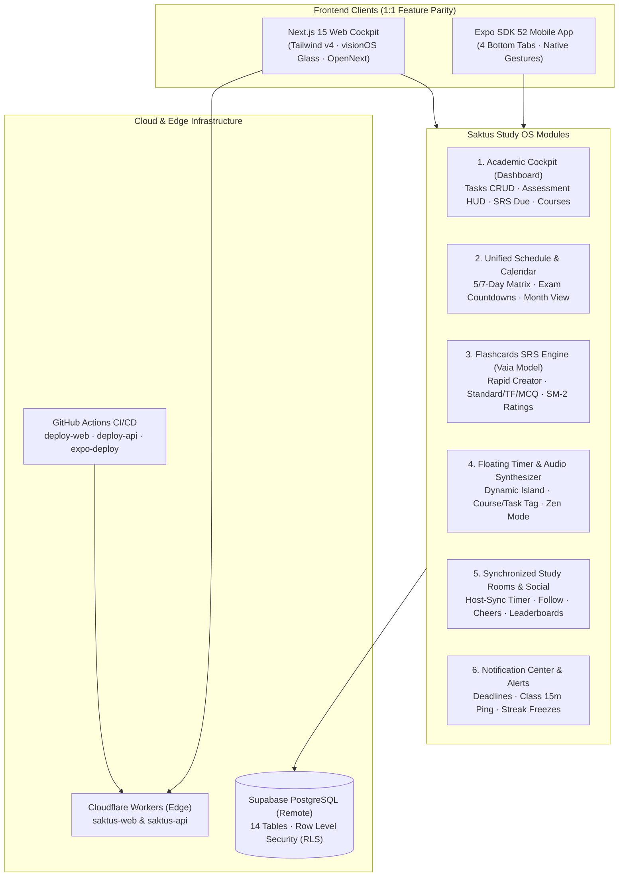

# Saktus Academic OS — Architecture & Implementation Masterplan

*Document Version:* 3.0.0 — Production Engineering Specification  
*Target Repository:* `C:\Users\letha\Documents\GitHub\FLOWSTATEV1`  
*Architecture:* pnpm Monorepo (Next.js 15 OpenNext Cloudflare + Expo SDK 52 + Supabase PostgreSQL)  
*Design Standard:* Apple Human Interface Guidelines + Emil Kowalski Craft + visionOS Glassmorphism  
*Audit Standard:* 100-Point Pre-Launch Engineering System (`checklist.md`)  
*Date:* September 2026  

---

## 1. Core Principles & Non-Negotiable Guardrails

1. **Zero Emojis in Codebase**:
   - Strict adherence: **Lucide icons only** (`lucide-react` on Web, `lucide-react-native` on Mobile).
   - Zero unicode emojis anywhere in source code, copy, badges, status indicators, or toasts.
2. **Web & Mobile 1:1 Parity**:
   - Identical feature sets, business logic, data models, and fluid visionOS aesthetic.
   - Any feature available on Web is natively available on Mobile, and vice versa.
3. **Strict 4-Tab Bottom Navbar on Mobile**:
   - **Home** (`Home` icon) — The Academic Cockpit (Dashboard, Tasks CRUD, Assessment HUD, Course Progress)
   - **Schedule** (`Calendar` icon) — Unified Timetable Matrix & Exam Deadlines Calendar
   - **Cards** (`Layers` icon) — SM-2 Flashcard Engine, Multi-Type Card Creator & Deck Hub
   - **Social** (`Users` icon) — Friends, Synchronized Study Rooms, & Profile
4. **Dashboard is the Star of the Show**:
   - The Cockpit integrates upcoming assessments, tasks & reminders with inline CRUD, course hours progress, and SRS review rings.
   - The Timer is not the central tab; it is an omnipresent floating mini-player.
5. **Timer as an Omnipresent Floating Mini-Player**:
   - Floating Dynamic Island style pill persistent across all tabs and screens.
   - 1-tap expansion into fullscreen Zen / OLED mode with procedural Web Audio soundscapes.
   - Timestamp delta-based (resilient to browser lock screen, sleep mode, tab suspension, or reload).
6. **No Local Machine Heavy Builds**:
   - Zero local build commands or heavy processor tasks on the developer's PC.
   - All builds and deployments are tested and executed via GitHub Actions CI/CD pipelines to Cloudflare Workers and Expo EAS.

---

## 2. System Architecture



---

## 3. Database Schema & Migration Specification

### 3.1 Migration File: `supabase/migrations/20260913_saktus_v3_schema.sql`

```sql
-- ============================================================
-- SAKTUS MASTER SCHEMA V3 (STUDENT OS + FLASHCARDS + SOCIAL)
-- ============================================================

-- 1. Profiles & Public Handle
ALTER TABLE profiles 
ADD COLUMN IF NOT EXISTS username TEXT UNIQUE;

CREATE INDEX IF NOT EXISTS idx_profiles_username ON profiles(username);

-- 2. Flashcards Enhancement (Card Types & Interactive Formats)
ALTER TABLE flashcards
ADD COLUMN IF NOT EXISTS card_type TEXT DEFAULT 'standard' CHECK (card_type IN ('standard', 'true_false', 'multiple_choice')),
ADD COLUMN IF NOT EXISTS options JSONB DEFAULT '[]'::jsonb,
ADD COLUMN IF NOT EXISTS correct_answer TEXT;

-- 3. Flashcard Decks Tags
ALTER TABLE flashcard_decks
ADD COLUMN IF NOT EXISTS tags TEXT[] DEFAULT '{}'::text[];

-- 4. Tasks & Reminders Link to Courses
ALTER TABLE tasks
ADD COLUMN IF NOT EXISTS course_id UUID REFERENCES courses(id) ON DELETE SET NULL;

CREATE INDEX IF NOT EXISTS idx_tasks_user_course ON tasks(user_id, course_id);

-- 5. In-App Notification Center
CREATE TABLE IF NOT EXISTS notifications (
    id UUID PRIMARY KEY DEFAULT gen_random_uuid(),
    user_id UUID REFERENCES profiles(id) ON DELETE CASCADE NOT NULL,
    title TEXT NOT NULL,
    message TEXT NOT NULL,
    type TEXT NOT NULL CHECK (type IN ('deadline', 'class', 'streak', 'social', 'system')),
    read BOOLEAN DEFAULT FALSE,
    link TEXT,
    created_at TIMESTAMPTZ DEFAULT NOW()
);

CREATE INDEX IF NOT EXISTS idx_notifications_user_read ON notifications(user_id, read);

ALTER TABLE notifications ENABLE ROW LEVEL SECURITY;

CREATE POLICY "Users view and manage their own notifications"
ON notifications FOR ALL
USING (auth.uid() = user_id);

-- 6. Synchronized Study Rooms
CREATE TABLE IF NOT EXISTS study_rooms (
    id UUID PRIMARY KEY DEFAULT gen_random_uuid(),
    host_id UUID REFERENCES profiles(id) ON DELETE CASCADE NOT NULL,
    name TEXT NOT NULL,
    code TEXT UNIQUE NOT NULL,
    course_id UUID REFERENCES courses(id) ON DELETE SET NULL,
    duration_minutes INTEGER DEFAULT 25,
    mode TEXT DEFAULT 'pomodoro' CHECK (mode IN ('pomodoro', 'stopwatch')),
    status TEXT DEFAULT 'active' CHECK (status IN ('active', 'paused', 'completed')),
    started_at TIMESTAMPTZ DEFAULT NOW(),
    ends_at TIMESTAMPTZ,
    created_at TIMESTAMPTZ DEFAULT NOW()
);

CREATE TABLE IF NOT EXISTS study_room_members (
    room_id UUID REFERENCES study_rooms(id) ON DELETE CASCADE NOT NULL,
    user_id UUID REFERENCES profiles(id) ON DELETE CASCADE NOT NULL,
    joined_at TIMESTAMPTZ DEFAULT NOW(),
    completed BOOLEAN DEFAULT FALSE,
    PRIMARY KEY(room_id, user_id)
);

ALTER TABLE study_rooms ENABLE ROW LEVEL SECURITY;
ALTER TABLE study_room_members ENABLE ROW LEVEL SECURITY;

CREATE POLICY "Users can view active study rooms"
ON study_rooms FOR SELECT
USING (true);

CREATE POLICY "Hosts manage their study rooms"
ON study_rooms FOR ALL
USING (auth.uid() = host_id);

CREATE POLICY "Members manage their room participation"
ON study_room_members FOR ALL
USING (auth.uid() = user_id);
```

---

## 4. Module Specifications

### Module 1: The Academic Cockpit (Dashboard)
The central command center of Saktus.
- **Urgency-First Information Architecture**:
  1. **Next Class Up Pill**: Calculates current day/time vs timetable, showing course code, room venue, and countdown minutes with live indicator.
  2. **Critical Assessments HUD**: Chronological list of exams/assignments due within 14 days with weight percentage, urgency coloring (<7d coral, 7-14d amber), and inline '+' button for instant creation.
  3. **Tasks & Reminders Widget**:
     - Inline quick-add (`+ Add task... [Enter]`).
     - Priority badges (`Urgent`, `High`, `Normal`).
     - Course attribution selector.
     - Inline completion with strike-through and undo toast.
     - Full edit modal (due time, notes, course).
  4. **SRS Flashcards Due Ring**: Radial SVG ring showing cards due today across all enrolled subjects with a 1-tap `Review Now` trigger.
  5. **Course Cards Grid**: Shows enrolled subjects, target weekly study hours progress bar (e.g. 4.5 / 6.0 hrs), and instant buttons for `Start Focus` and `Decks`.
  6. **In-App Notification Center**: Top-bar bell icon with unread badge counter, tab filters (`All`, `Deadlines`, `Classes`, `Social`), and `Mark All Read`.

### Module 2: Unified Schedule & Calendar
- **Class Timetable Matrix**:
  - 5-day / 7-day responsive grid with current-time indicator line.
  - Class cards displaying course code, venue/room, lecturer, time range, and type (Lecture, Tutorial, Lab).
  - Full CRUD: Add class, edit venue/time, delete class.
- **Unified Calendar Toggle**:
  - Week and Month views aggregating recurring classes, assessment due dates, and task deadlines.
  - Color-coded badges matching course identity.

### Module 3: Flashcards SRS Engine (Vaia Model)
- **Rapid-Fire Card Creation**:
  - Multi-type card support:
    - **Standard Front / Back**: Active recall flip.
    - **True / False**: Statement with instant True/False buttons.
    - **Multiple Choice (MCQ)**: 3-4 option choices with correct answer validation and explanation reveal.
  - Press Enter to save and instantly create the next card.
- **Deck Grouping & Filtering**:
  - Two-tier hierarchy: Course -> Deck with flexible `#topic` tags.
  - Filter bar: By Course, By Review Status (`Due Today`, `Learning`, `Mastered`), and full-text search.
- **Deck & Card CRUD**:
  - Inline editing of card front/back/options.
  - Duplicate card, delete card, bulk delete, and `Reset SRS Intervals` button.
- **Interactive 3D Study View**:
  - Spring-settled perspective card flip (`transform: rotateY(180deg)`).
  - SM-2 spaced repetition rating buttons (`Again`, `Hard`, `Good`, `Easy`) with keyboard bindings (`Space`, `1`, `2`, `3`, `4`).

### Module 4: Focus Timer & Web Audio Synthesizer
- **Floating Mini-Player (Dynamic Island)**:
  - Persistent sticky widget across all Web pages and Mobile screens.
  - Displays remaining/elapsed time, course tag, and Play/Pause button.
  - Tap expands into fullscreen Zen mode.
- **Timestamp Delta Resilience**:
  - Stores `target_end_timestamp` in persistent storage; zero drift on phone lock or tab sleep.
- **Web Audio Sound Generator**:
  - Procedural sound synthesis running client-side with zero external MP3 assets:
    - Binaural Beats (40Hz Gamma frequency)
    - Brown Noise (low-pass filtered deep acoustic comfort)
    - Rain Synthesizer (pink noise with resonant frequency modulation)
    - Ambient Drone (multi-oscillator warm harmonic pad)
  - Independent volume sliders.
- **Focus Attribution & Wrap-up**:
  - Tagged to Course + Task/Assessment.
  - Post-session rating dialog (1-5 stars) + reflection notes saved to `study_sessions`.

### Module 5: Synchronized Study Rooms & Social
- **Follow Friends**:
  - One-way follow system by `@username` or email.
  - Live status indicator showing friends currently studying with active course tag.
- **Synchronized Study Rooms**:
  - Host creates room or starts session; friends join via 6-character code or `Study Along` button.
  - Host controls start/pause/break intervals with synchronized countdown.
  - Live avatar stack showing participant presence.
  - 1-tap haptic Cheers (icons only: `Zap`, `Flame`, `Coffee`, `ThumbsUp`).
  - Group study completion bonus (+10 XP).
- **Public Profile Card & App Sharing**:
  - Public profile page (`/u/:username`) showing avatar, name, degree, and study streak.
  - 1-tap aesthetic dark-mode summary card generation for WhatsApp and Instagram stories.

---

## 5. Mobile App Specifications (Strict 4 Bottom Tabs)

`apps/mobile/app/(tabs)/_layout.tsx`:
```tsx
// Strictly 4 Bottom Navigation Tabs
<Tabs>
  <Tabs.Screen name="index" options={{ title: 'Home', tabBarIcon: Home }} />
  <Tabs.Screen name="schedule" options={{ title: 'Schedule', tabBarIcon: Calendar }} />
  <Tabs.Screen name="cards" options={{ title: 'Cards', tabBarIcon: Layers }} />
  <Tabs.Screen name="social" options={{ title: 'Social', tabBarIcon: Users }} />
</Tabs>
```
- Floating Focus Timer Mini-Player mounted above the bottom navigation bar across all 4 screens.
- Full parity with Web: Tasks CRUD, Assessment HUD, Course cards, Flashcard SRS review, and Study Rooms.

---

## 6. Phased Implementation Steps

| Phase | Description | Deliverables |
|---|---|---|
| **Phase 1** | Remote Database & Shared Types | Supabase SQL migration, `@flowstate/shared` types & Zod schemas |
| **Phase 2** | Cockpit Dashboard & Tasks CRUD | Web & Mobile Dashboard with inline tasks, assessment HUD, notifications |
| **Phase 3** | Flashcards SRS & Multi-Question Types | Rapid creator, Standard/TF/MCQ cards, topic filters, 3D study view |
| **Phase 4** | Floating Timer & Audio Synthesizer | Dynamic Island mini-player, procedural soundscapes, Zen mode |
| **Phase 5** | Study Rooms & Social Network | Host-sync timer rooms, follow system, public profiles, Cheers |
| **Phase 6** | Mobile Refactor & CI/CD Deployment | 4-tab layout, EAS & Cloudflare automated deployment verification |
