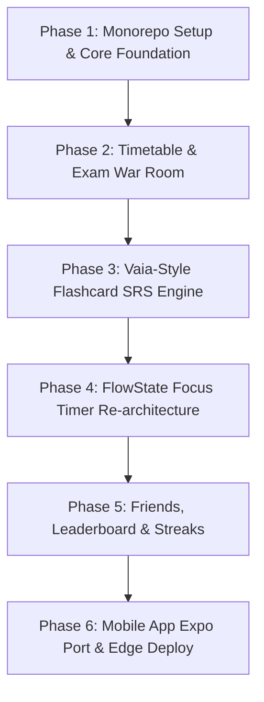

# FlowState Study OS — Comprehensive Architecture & UI/UX Master Blueprint
## The All-in-One Academic Cockpit: Timetables, Exam War Room, Flashcards (Vaia/StudySmarter Model), Focus Timer, Social Squads & Streaks

*Document Version:* 2.0.0 — Production Specification & Implementation Masterplan  
*Repository Target:* `C:\Users\letha\Documents\GitHub\FLOWSTATEV1`  
*Architecture Pattern:* Monorepo (`pnpm` + Turborepo + Next.js 15 OpenNext Cloudflare + Expo SDK 52 + Supabase)  
*Design Standard:* Apple Human Interface Guidelines + Emil Kowalski Design Engineering (Craft, Springs, Zero Vibe-Coded Slop)  
*Date:* September 2026

---

## 1. Executive Product Strategy & The Vaia / StudySmarter Model

### 1.1 The Vision: The Calm Academic Cockpit
Students do not fail because they lack intelligence; they fail because their academic lives are fractured across 6 disconnected tools:
1. Timetable on a PDF or university portal
2. Exam dates on a calendar or pinned WhatsApp message
3. Flashcards in Anki or Quizlet
4. Study timer in Forest or phone clock
5. Study group accountability on WhatsApp / Discord
6. Lecture notes in Apple Notes or physical books

**FlowState Study OS** consolidates all six into one cohesive, beautifully engineered workspace with dark-mode aesthetic, zero latency, and physical, fluid interactions.

### 1.2 The Vaia (StudySmarter) Flashcard Engine Blueprint
Vaia became a multi-million-user platform because of its specific flashcard loop:
- **Deck-to-Course Hierarchy:** Flashcard decks are strictly tied to specific courses (`Subject > Module/Chapter > Deck > Flashcards`).
- **3-Second Card Creation:** Create cards via Rich Text (front/back), image drop, or **AI lecture/slide extraction**.
- **Spaced Repetition System (SRS):** Leitner / SM-2 spaced repetition algorithms with 4 feedback buttons (`Again` / `Hard` / `Good` / `Easy`) calculating the exact next review timestamp.
- **Shared Course Decks:** Students can toggle a deck to "Course Public" so friends in the same class/squad can study from the exact same flashcard deck.

---

## 2. Deep UI/UX Design Engineering Specification
*Adhering strictly to Apple Fluid Interfaces, WWDC Principles, and Emil Kowalski Design Craft.*

### 2.1 Aesthetic Guardrails: Zero "Vibe-Coded" Giveaways
What distinguishes professional software from cheap, vibe-coded AI templates:
- **NO generic purple gradients or neon glassmorphism slop.**
- **NO `transition: all 300ms`** (this animates width/height changes sluggishly and causes repaint thrashing).
- **NO `scale(0)` entrances:** Nothing in the physical world pops into existence from zero. Scale entrances start at `scale(0.95)` with `opacity: 0`.
- **NO non-interruptible fixed CSS `@keyframes` on touch elements:** Everything the user touches uses physical springs with velocity handoff.
- **NO dead press states:** Every button highlights on `pointerdown` (active press `scale(0.97)`), not on release.

### 2.2 Micro-Interactions & Animation Vocabulary
| UI Component | Interaction Technique | Technical Implementation | Why (The Craft) |
|---|---|---|---|
| **Flashcard Flip** | 3D Perspective Flip with spring settle | `transform: rotateY(180deg)` with `perspective: 1000px`, spring `bounce: 0.1, duration: 0.45s` | Feels like a physical index card with genuine tactile inertia. |
| **Timer Start / Pause** | Morphing Control Pill + Rubber-band scale | Spring `bounce: 0.2`, damping `0.85` | Direct manipulation feedback confirms the user's focus commitment. |
| **Streak Flame Counter** | Origin-aware pop with subtle bounce | `scale(0.92)` to `scale(1.06)` back to `scale(1.0)`, spring `bounce: 0.25` | Delivers neurological reward for streak continuation without feeling childish. |
| **Next Class / Exam Card** | Shared element transition on tap | Layout animation tracking geometry from list to modal detail | Preserves mental spatial orientation. |
| **Friends Live Status Pulse** | Subtle scale-pulse ring with 2s interval | `opacity: 0.7 -> 0.2`, `scale: 1.0 -> 1.4` | Ambient awareness of study partner without visual distraction. |

---

## 3. The 6 Core Modules: Detailed Specifications

### Module 1: The Timetable & Schedule Matrix
- **Visual Matrix:** 5-day / 7-day responsive grid view with current-time red indicator line.
- **Class Attributes:** Subject name, course code, lecturer, room/venue, building, recurring day/time, tutorial vs lecture vs lab.
- **Smart "Next Up" Dynamic Island / Header Pill:**
  - *"Next: CS201 Algorithms · Science Block Room 3 · in 24 mins"*
- **ICS Calendar Feed:** Web & Mobile offer a live subscribed URL to sync timetable with Apple Calendar / Google Calendar.

### Module 2: Exam & Assessment War Room
- **Countdown HUD:** Sorted chronologically by urgency (Days remaining, weighting % towards final mark).
- **Color-Coded Readiness Bar:**
  - `> 14 days`: Subtle slate
  - `7 - 14 days`: Amber warning
  - `< 7 days`: High-urgency Coral (`#FF3B30`)
- **Study Progress vs. Target Hours:** Set target revision hours per exam (e.g. 20h for Calculus) with a filled radial progress ring.

### Module 3: Flashcard Study Engine (Vaia / SM-2 Spaced Repetition)
- **Study Modes:**
  - *Standard Spaced Repetition:* SM-2 algorithm queues cards due today based on difficulty rating.
  - *Exam Cram Mode:* Cycles through all cards in the deck regardless of interval.
  - *Match / Quick Fire:* Timed gamified matching.
- **Card Content Support:** Front/Back markdown, code blocks, math formulas (KaTeX), and image attachments.
- **AI Card Deck Generation:** Paste lecture notes, syllabus PDF, or slide transcript → AI produces a structured 20-card deck with definitions and key concepts.

### Module 4: FlowState Focus Timer (Preserving & Upgrading Existing Repo)
- **Tag-to-Course Binding:** Every session must be tagged to an active course (`MTH201`, `LAWS101`, `General`).
- **Pomodoro & Stopwatch Modes:** 25/5, 50/10, or open-ended deep flow stopwatch.
- **Subject Mastery Analytics:** Weekly and monthly stacked bar charts showing hours invested per course.

### Module 5: Friends, Squads & Live Library (The Social Moat)
- **Active Friends List:** Real-time indicator showing who is currently in a session:
  > **Kagiso T.** · *Studying Data Structures* · 🟢 34m left in session
- **Squads:** Create study groups (e.g. *"Room 404 Res Boys"*, *"UCT Law Class of 26"*).
- **Weekly Leaderboard:** Rank by total focus hours and cards reviewed this week (resets Sunday midnight).
- **1-Tap Non-Distracting "Cheers":** Tap a friend to send a `⚡ Locked In` or `☕ Take a Break` haptic ping to their phone.

### Module 6: Daily & Weekly Streaks
- **Streak Rules:** Completing at least one 25-minute focus session OR reviewing 15 flashcards maintains the streak.
- **Streak Freezes (The Duolingo Mechanic):** 1 freeze earned every 7 consecutive days of studying, preventing demoralizing streak loss during illness or weekends.
- **Streak Share Cards:** 1-tap aesthetic dark-mode summary card designed for Instagram / WhatsApp stories.

---

## 4. Technical Architecture: Estavo Monorepo Pattern

We reuse the battle-tested **Estavo monorepo structure**, **Cloudflare OpenNext deployment**, and **Supabase client/server architecture**:

### 4.1 Topology

```
C:\Users\letha\Documents\GitHub\FLOWSTATEV1\
├── apps/
│   ├── web/                    ← Next.js 15 (App Router) Desktop & Tablet Web App
│   │   ├── src/app/
│   │   │   ├── (auth)/         ← OTP & Magic link login
│   │   │   ├── (dashboard)/
│   │   │   │   ├── timetable/  ← Schedule grid & class manager
│   │   │   │   ├── exams/      ← War room & countdowns
│   │   │   │   ├── flashcards/ ← Decks, card editor, SM-2 study view
│   │   │   │   ├── timer/      ← FlowState deep work timer (migrated from app.js)
│   │   │   │   ├── friends/    ← Squads, live studying now, leaderboards
│   │   │   │   └── analytics/  ← Subject mastery & streak calendar
│   │   ├── open-next.config.ts ← Cloudflare Workers edge configuration
│   │   └── wrangler.toml
│   │
│   └── mobile/                 ← Expo SDK 52 + Expo Router (iOS & Android)
│       ├── app/
│       │   ├── (auth)/
│       │   └── (tabs)/         ← Timetable, Exams, Flashcards, Timer, Friends
│       ├── components/
│       └── package.json
│
├── lib/
│   ├── study-engine/           ← SM-2 spaced repetition math, AI flashcard parser, streak calculator
│   │   ├── src/
│   │   │   ├── sm2.ts          ← Spaced repetition interval calculator
│   │   │   ├── streaks.ts      ← Streak and freeze logic
│   │   │   └── ai-deck.ts      ← Notes-to-Flashcards generator
│   │   └── package.json
│   │
│   ├── ui/                     ← Shared design system (Tailwind CSS v4 + React 19)
│   │   ├── src/components/     ← Flashcard, TimerCircle, LeaderboardRow, StreakBadge
│   │   └── package.json
│   │
│   └── shared/                 ← Common TypeScript types and Zod schemas
│       ├── src/types.ts
│       └── package.json
│
├── supabase/
│   └── migrations/             ← Complete Postgres database schema (DDL below)
│
├── pnpm-workspace.yaml         ← Monorepo workspace definition with version catalog
├── turbo.json                  ← Turborepo task pipeline
└── package.json                ← Root package scripts
```

---

## 5. Production Database Schema (PostgreSQL / Supabase DDL)

```sql
-- Enable necessary extensions
CREATE EXTENSION IF NOT EXISTS "uuid-ossp";

-- 1. Profiles & Student Metadata
CREATE TABLE profiles (
    id UUID PRIMARY KEY REFERENCES auth.users(id) ON DELETE CASCADE,
    email TEXT NOT NULL,
    full_name TEXT NOT NULL,
    avatar_url TEXT,
    university TEXT,
    degree TEXT,
    study_streak_days INTEGER DEFAULT 0,
    longest_streak_days INTEGER DEFAULT 0,
    last_study_date DATE,
    streak_freezes_available INTEGER DEFAULT 1,
    is_studying_now BOOLEAN DEFAULT FALSE,
    current_subject TEXT,
    session_ends_at TIMESTAMPTZ,
    created_at TIMESTAMPTZ DEFAULT NOW(),
    updated_at TIMESTAMPTZ DEFAULT NOW()
);

-- 2. Courses / Subjects
CREATE TABLE courses (
    id UUID PRIMARY KEY DEFAULT gen_random_uuid(),
    user_id UUID REFERENCES profiles(id) ON DELETE CASCADE NOT NULL,
    name TEXT NOT NULL,              -- e.g. "Computer Science 201"
    code TEXT NOT NULL,              -- e.g. "CSC2001F"
    color TEXT DEFAULT '#0A84FF',   -- Hex accent color for timetable & charts
    target_hours_per_week NUMERIC(4, 1) DEFAULT 6.0,
    created_at TIMESTAMPTZ DEFAULT NOW()
);

-- 3. Timetable / Classes
CREATE TABLE timetable_classes (
    id UUID PRIMARY KEY DEFAULT gen_random_uuid(),
    course_id UUID REFERENCES courses(id) ON DELETE CASCADE NOT NULL,
    user_id UUID REFERENCES profiles(id) ON DELETE CASCADE NOT NULL,
    day_of_week INTEGER CHECK (day_of_week BETWEEN 1 AND 7), -- 1=Mon, 7=Sun
    start_time TIME NOT NULL,
    end_time TIME NOT NULL,
    venue TEXT,                      -- e.g. "Science Lecture Theatre 2"
    class_type TEXT DEFAULT 'lecture', -- 'lecture', 'tutorial', 'lab', 'workshop'
    created_at TIMESTAMPTZ DEFAULT NOW()
);

-- 4. Exams & Assessments
CREATE TABLE assessments (
    id UUID PRIMARY KEY DEFAULT gen_random_uuid(),
    course_id UUID REFERENCES courses(id) ON DELETE CASCADE NOT NULL,
    user_id UUID REFERENCES profiles(id) ON DELETE CASCADE NOT NULL,
    title TEXT NOT NULL,             -- e.g. "Midterm Test 1"
    type TEXT CHECK (type IN ('exam', 'test', 'assignment', 'project', 'quiz')),
    due_date TIMESTAMPTZ NOT NULL,
    venue TEXT,
    weight_percentage NUMERIC(5, 2), -- e.g. 35.00 (%)
    target_study_hours NUMERIC(5, 1) DEFAULT 15.0,
    completed BOOLEAN DEFAULT FALSE,
    created_at TIMESTAMPTZ DEFAULT NOW()
);

-- 5. Flashcard Decks & Cards (Vaia Model with SM-2)
CREATE TABLE flashcard_decks (
    id UUID PRIMARY KEY DEFAULT gen_random_uuid(),
    course_id UUID REFERENCES courses(id) ON DELETE CASCADE NOT NULL,
    user_id UUID REFERENCES profiles(id) ON DELETE CASCADE NOT NULL,
    title TEXT NOT NULL,             -- e.g. "Chapter 4: Binary Trees & Heaps"
    description TEXT,
    is_public BOOLEAN DEFAULT FALSE,
    created_at TIMESTAMPTZ DEFAULT NOW()
);

CREATE TABLE flashcards (
    id UUID PRIMARY KEY DEFAULT gen_random_uuid(),
    deck_id UUID REFERENCES flashcard_decks(id) ON DELETE CASCADE NOT NULL,
    user_id UUID REFERENCES profiles(id) ON DELETE CASCADE NOT NULL,
    front_text TEXT NOT NULL,
    back_text TEXT NOT NULL,
    -- SM-2 Algorithm Attributes
    repetition_number INTEGER DEFAULT 0,
    interval_days INTEGER DEFAULT 0,
    ease_factor NUMERIC(4, 2) DEFAULT 2.50,
    due_date DATE DEFAULT CURRENT_DATE,
    created_at TIMESTAMPTZ DEFAULT NOW(),
    updated_at TIMESTAMPTZ DEFAULT NOW()
);

-- 6. Study Sessions (Timer Logs)
CREATE TABLE study_sessions (
    id UUID PRIMARY KEY DEFAULT gen_random_uuid(),
    user_id UUID REFERENCES profiles(id) ON DELETE CASCADE NOT NULL,
    course_id UUID REFERENCES courses(id) ON DELETE SET NULL,
    duration_seconds INTEGER NOT NULL,
    mode TEXT CHECK (mode IN ('pomodoro', 'stopwatch')),
    completed_at TIMESTAMPTZ DEFAULT NOW(),
    notes TEXT
);

-- 7. Social / Friends / Squads
CREATE TABLE friendships (
    id UUID PRIMARY KEY DEFAULT gen_random_uuid(),
    user_id UUID REFERENCES profiles(id) ON DELETE CASCADE NOT NULL,
    friend_id UUID REFERENCES profiles(id) ON DELETE CASCADE NOT NULL,
    status TEXT CHECK (status IN ('pending', 'accepted', 'blocked')) DEFAULT 'pending',
    created_at TIMESTAMPTZ DEFAULT NOW(),
    UNIQUE(user_id, friend_id)
);

CREATE TABLE squads (
    id UUID PRIMARY KEY DEFAULT gen_random_uuid(),
    created_by UUID REFERENCES profiles(id) ON DELETE CASCADE NOT NULL,
    name TEXT NOT NULL,
    code TEXT UNIQUE NOT NULL,       -- 6-character squad join code
    created_at TIMESTAMPTZ DEFAULT NOW()
);

CREATE TABLE squad_members (
    squad_id UUID REFERENCES squads(id) ON DELETE CASCADE NOT NULL,
    user_id UUID REFERENCES profiles(id) ON DELETE CASCADE NOT NULL,
    joined_at TIMESTAMPTZ DEFAULT NOW(),
    PRIMARY KEY(squad_id, user_id)
);

-- Row Level Security (RLS)
ALTER TABLE profiles ENABLE ROW LEVEL SECURITY;
ALTER TABLE courses ENABLE ROW LEVEL SECURITY;
ALTER TABLE timetable_classes ENABLE ROW LEVEL SECURITY;
ALTER TABLE assessments ENABLE ROW LEVEL SECURITY;
ALTER TABLE flashcard_decks ENABLE ROW LEVEL SECURITY;
ALTER TABLE flashcards ENABLE ROW LEVEL SECURITY;
ALTER TABLE study_sessions ENABLE ROW LEVEL SECURITY;
ALTER TABLE friendships ENABLE ROW LEVEL SECURITY;
ALTER TABLE squads ENABLE ROW LEVEL SECURITY;
ALTER TABLE squad_members ENABLE ROW LEVEL SECURITY;

-- Base RLS Policy: Users own their private data
CREATE POLICY "Users can view and edit their own profiles" ON profiles FOR ALL USING (auth.uid() = id);
CREATE POLICY "Users manage their own courses" ON courses FOR ALL USING (auth.uid() = user_id);
CREATE POLICY "Users manage their own timetable" ON timetable_classes FOR ALL USING (auth.uid() = user_id);
CREATE POLICY "Users manage their own assessments" ON assessments FOR ALL USING (auth.uid() = user_id);
CREATE POLICY "Users manage their own decks" ON flashcard_decks FOR ALL USING (auth.uid() = user_id OR is_public = true);
CREATE POLICY "Users manage their own flashcards" ON flashcards FOR ALL USING (auth.uid() = user_id);
CREATE POLICY "Users manage their study sessions" ON study_sessions FOR ALL USING (auth.uid() = user_id);
```

---

## 6. Phased Implementation Roadmap



### Phase 1: Monorepo Foundation & pnpm Workspace
- Initialize `pnpm-workspace.yaml` with version catalog matching Estavo.
- Set up `apps/web` (Next.js 15), `lib/study-engine`, `lib/ui`, and `lib/shared`.
- Establish shared Tailwind CSS v4 design tokens and fonts (Inter + JetBrains Mono).

### Phase 2: Timetable & Exam War Room
- Build the 5/7-day schedule grid with interactive class card creation.
- Build the countdown war room displaying days remaining and weighted progress rings.

### Phase 3: Flashcard System (Vaia Model)
- Implement SM-2 algorithm in `lib/study-engine/src/sm2.ts`.
- Build 3D card-flip study interface with keyboard controls (`Space` = flip, `1/2/3/4` = rating).
- Build AI Deck Creator: upload text/slides → generates cards automatically.

### Phase 4: Focus Timer & Subject Analytics
- Port the clean, aesthetic timer from `FLOWSTATEV1/app.js` into React 19 with spring animations.
- Link timer completions directly to subject hours and streak increments.

### Phase 5: Squads, Friends Live Feed & Streaks
- Real-time Presence: Polling/Supabase Realtime showing friends studying right now.
- Weekly campus/squad leaderboard with automatic Sunday resets.
- Streak protection logic and story/status graphic generation.

### Phase 6: Mobile Client (Expo SDK 52) & Cloudflare Production Deploy
- Scaffold `apps/mobile` with Expo Router.
- Deploy `apps/web` to Cloudflare Workers using OpenNext.
