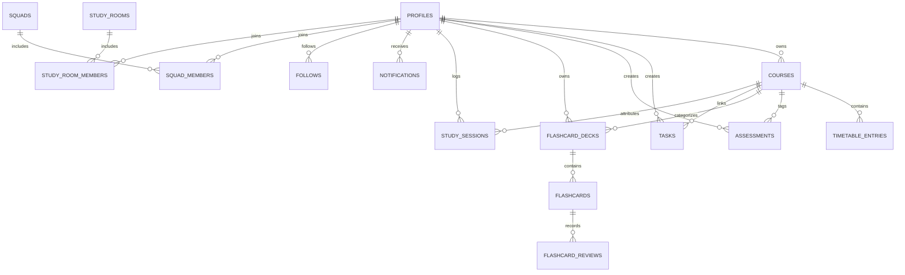

# Saktus Database Architecture & Row Level Security (RLS)

## 1. Overview & Data Philosophy

The Saktus backend is built on **Supabase Managed PostgreSQL**. Every table in the system is protected by strict PostgreSQL **Row Level Security (RLS)** policies ensuring rigorous multi-tenant data isolation.

---

## 2. Entity Relationship Diagram



---

## 3. Database Schema Specification (14 Tables)

### 3.1 `profiles`
Represents the authenticated student user.
- `id` (UUID, PK, references `auth.users.id` on delete cascade)
- `username` (TEXT, UNIQUE, public handle e.g. `@bryson`)
- `full_name` (TEXT)
- `avatar_url` (TEXT)
- `institution` (TEXT, university name)
- `degree` (TEXT, major / course of study)
- `daily_goal_minutes` (INTEGER, default 120)
- `created_at` (TIMESTAMPTZ, default now())

### 3.2 `courses`
Academic subjects enrolled by the student.
- `id` (UUID, PK, default `gen_random_uuid()`)
- `user_id` (UUID, FK -> `profiles.id`)
- `name` (TEXT, e.g. "Computer Systems")
- `code` (TEXT, e.g. "CS201")
- `color` (TEXT, e.g. "bg-blue-500")
- `target_weekly_hours` (NUMERIC, e.g. 6.0)
- `created_at` (TIMESTAMPTZ)

### 3.3 `timetable_entries`
Weekly recurring class schedule.
- `id` (UUID, PK)
- `user_id` (UUID, FK -> `profiles.id`)
- `course_id` (UUID, FK -> `courses.id`)
- `day_of_week` (INTEGER, 1=Monday through 7=Sunday)
- `start_time` (TIME, e.g. "09:00:00")
- `end_time` (TIME, e.g. "10:30:00")
- `location` (TEXT, venue/room coordinates e.g. "Lecture Hall 3B")
- `type` (TEXT, check in `lecture`, `tutorial`, `lab`, `seminar`)

### 3.4 `assessments`
Chronological exams and assignment deadlines.
- `id` (UUID, PK)
- `user_id` (UUID, FK -> `profiles.id`)
- `course_id` (UUID, FK -> `courses.id`)
- `title` (TEXT, e.g. "Algorithms Midterm Exam")
- `due_date` (TIMESTAMPTZ)
- `weight_percentage` (NUMERIC, e.g. 25.0)
- `completed` (BOOLEAN, default false)
- `created_at` (TIMESTAMPTZ)

### 3.5 `tasks`
Daily academic reminders and action items.
- `id` (UUID, PK)
- `user_id` (UUID, FK -> `profiles.id`)
- `course_id` (UUID, nullable, FK -> `courses.id`)
- `text` (TEXT)
- `priority` (TEXT, check in `urgent`, `high`, `normal`)
- `due_date` (TIMESTAMPTZ, nullable)
- `done` (BOOLEAN, default false)
- `created_at` (TIMESTAMPTZ)

### 3.6 `flashcard_decks`
Deck containers organized strictly under academic subjects.
- `id` (UUID, PK)
- `user_id` (UUID, FK -> `profiles.id`)
- `course_id` (UUID, FK -> `courses.id`)
- `title` (TEXT, e.g. "Chapter 4: B-Trees & AVL")
- `tags` (TEXT[], default `'{}'`)
- `created_at` (TIMESTAMPTZ)

### 3.7 `flashcards`
Individual active recall cards supporting multiple formats.
- `id` (UUID, PK)
- `deck_id` (UUID, FK -> `flashcard_decks.id`)
- `front` (TEXT, prompt/question)
- `back` (TEXT, answer/explanation)
- `card_type` (TEXT, default `'standard'`, check in `standard`, `true_false`, `multiple_choice`)
- `options` (JSONB, array of strings for MCQ choices)
- `correct_answer` (TEXT, correct selection key)
- `repetition` (INTEGER, default 0)
- `interval_days` (INTEGER, default 0)
- `ease_factor` (NUMERIC, default 2.5)
- `next_review` (TIMESTAMPTZ, default now())
- `created_at` (TIMESTAMPTZ)

### 3.8 `flashcard_reviews`
Historical SM-2 review logs for analytics.
- `id` (UUID, PK)
- `card_id` (UUID, FK -> `flashcards.id`)
- `user_id` (UUID, FK -> `profiles.id`)
- `rating` (INTEGER, 0 to 5)
- `reviewed_at` (TIMESTAMPTZ, default now())

### 3.9 `study_sessions`
Completed focus sessions logged from the Focus Timer.
- `id` (UUID, PK)
- `user_id` (UUID, FK -> `profiles.id`)
- `course_id` (UUID, nullable, FK -> `courses.id`)
- `duration_seconds` (INTEGER)
- `mode` (TEXT, check in `pomodoro`, `stopwatch`, `break`)
- `rating` (INTEGER, 1-5 reflection rating)
- `notes` (TEXT)
- `completed_at` (TIMESTAMPTZ, default now())

### 3.10 `streaks`
Server-verified student study streaks and freezes.
- `user_id` (UUID, PK, FK -> `profiles.id`)
- `current_streak` (INTEGER, default 0)
- `longest_streak` (INTEGER, default 0)
- `last_active_date` (DATE)
- `freezes_available` (INTEGER, default 2)
- `freezes_used_total` (INTEGER, default 0)

### 3.11 `follows`
One-way directional following graph. Mutual friendship is derived:
`A follows B AND B follows A`.
- `follower_id` (UUID, FK -> `profiles.id`)
- `followee_id` (UUID, FK -> `profiles.id`)
- `created_at` (TIMESTAMPTZ, default now())
- Primary Key: `(follower_id, followee_id)`

### 3.12 `squads` & `squad_members`
Study groups with code-based joining.
- `squads`: `id`, `name`, `code` (UNIQUE), `created_by` (UUID -> `profiles.id`), `created_at`.
- `squad_members`: `squad_id`, `user_id`, `joined_at`, Primary Key: `(squad_id, user_id)`.

### 3.13 `study_rooms` & `study_room_members`
Synchronized focus study rooms with host countdown control.
- `study_rooms`:
  - `id` (UUID, PK)
  - `host_id` (UUID, FK -> `profiles.id`)
  - `name` (TEXT)
  - `code` (TEXT, UNIQUE 6-char code)
  - `course_id` (UUID, nullable, FK -> `courses.id`)
  - `duration_seconds` (INTEGER, default 1500)
  - `elapsed_seconds_at_pause` (INTEGER, default 0)
  - `last_resumed_at` (TIMESTAMPTZ, nullable)
  - `status` (TEXT, check in `active`, `paused`, `completed`)
  - `created_at` (TIMESTAMPTZ)
- `study_room_members`:
  - `room_id` (UUID, FK -> `study_rooms.id`)
  - `user_id` (UUID, FK -> `profiles.id`)
  - `joined_at` (TIMESTAMPTZ)
  - Primary Key: `(room_id, user_id)`

### 3.14 `notifications`
In-app alert center populated by server triggers.
- `id` (UUID, PK)
- `user_id` (UUID, FK -> `profiles.id`)
- `title` (TEXT)
- `message` (TEXT)
- `type` (TEXT, check in `deadline`, `class`, `streak`, `social`, `system`)
- `read` (BOOLEAN, default false)
- `link` (TEXT)
- `created_at` (TIMESTAMPTZ)

---

## 4. Row Level Security (RLS) Law

Every table has `ENABLE ROW LEVEL SECURITY`.

### Private Data Isolation Rule
Users can strictly only `SELECT`, `INSERT`, `UPDATE`, and `DELETE` their own rows:
```sql
CREATE POLICY "Users access their own rows"
ON <table_name> FOR ALL
USING (auth.uid() = user_id)
WITH CHECK (auth.uid() = user_id);
```
Applied to: `courses`, `timetable_entries`, `assessments`, `tasks`, `flashcard_decks`, `study_sessions`, `streaks`.

### Study Room Visibility (Mutual Friends & Squads Only)
Never use `USING (true)` for room discovery. Access is strictly granted if:
1. User is the host, OR
2. User is already a joined member, OR
3. User and host share a mutual follow (`A->B` AND `B->A`), OR
4. User and host share an enrolled squad.

```sql
CREATE POLICY "Authorized users view study rooms"
ON study_rooms FOR SELECT
USING (
  auth.uid() = host_id
  OR EXISTS (SELECT 1 FROM study_room_members WHERE room_id = study_rooms.id AND user_id = auth.uid())
  OR EXISTS (
    SELECT 1 FROM follows f1
    JOIN follows f2 ON f1.follower_id = f2.followee_id AND f1.followee_id = f2.follower_id
    WHERE f1.follower_id = auth.uid() AND f1.followee_id = study_rooms.host_id
  )
  OR EXISTS (
    SELECT 1 FROM squad_members sm1
    JOIN squad_members sm2 ON sm1.squad_id = sm2.squad_id
    WHERE sm1.user_id = auth.uid() AND sm2.user_id = study_rooms.host_id
  )
);
```
